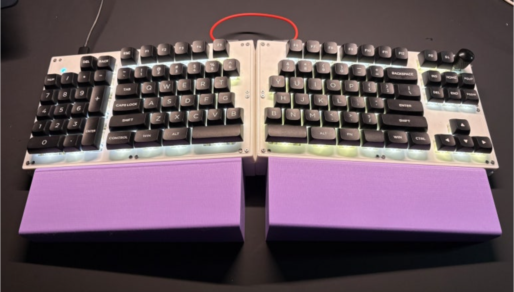

# V213-firmware

QMK firmware for the V213 split keyboard — a wired, southpaw-layout split board with an integrated left-side numpad, built around two ATmega32U4 controllers (one per half).

* Keyboard Maintainer: [AJG](https://github.com/Kesaros44)
* Hardware Supported: krsplit V213 split keyboard (AVR / ATmega32U4), wired only
* Hardware Availability: personal/custom build



## Hardware

- **MCU:** ATmega32U4 per half, `atmel-dfu` bootloader (32KB flash / 1KB EEPROM)
- **Matrix:** 6 rows × 11 columns per half, `COL2ROW` diode direction
- **Split communication:** soft serial, handedness via `SPLIT_USB_DETECT`
- **Encoder:** one rotary encoder, right half only
- **Backlight:** single-color PWM, 7 levels (Caps Lock LED on the left half only)
- **RGB underglow:** none
- Wired USB only — no battery, no sleep mode

## Keymap

Two build variants live side by side:

- **`keymaps/default`** — plain QMK, no VIA/Vial. Layers: `_WBASE` (Windows), `_MBASE` (Mac), `_WMFN1` (Fn — media/nav/backlight, bootloader reset).
- **`keymaps/vial`** — VIA/Vial-enabled, same 3 layers. `VIAL_INSECURE` is on, so it unlocks for editing with no combo needed.
- The encoder sends volume on the Mac layer, and the Windows media equivalent everywhere else.

## Building

GitHub Actions builds both keymaps on every push — grab the `.hex` files from the workflow run's artifacts, or use the pre-built `krsplit_default.hex` / `krsplit_v213_vial.hex` already included in this repo.

Local build (see `BUILD_AND_VIAL_GUIDE.txt` for the exact file setup):

```sh
# default keymap — needs mainline QMK
git clone --depth 1 https://github.com/qmk/qmk_firmware.git && cd qmk_firmware
make krsplit/v213:default

# vial keymap — needs the vial-qmk fork instead
git clone --depth 1 https://github.com/vial-kb/vial-qmk.git && cd vial-qmk
make krsplit/v213:vial
```

## Flashing

Enter the bootloader by pressing the `QK_RBT` key on the Fn layer (or the half's reset button, if present), then flash with `avrdude` or QMK Toolbox (`atmel-dfu`, `atmega32u4`). For the Vial keymap, open the [Vial app](https://vial.rocks) afterward — no unlock combo needed.

---

# V213-firmware (한국어)

V213 스플릿 키보드용 QMK 펌웨어입니다 — 왼쪽에 넘버패드가 통합된 유선 사우스포 스플릿 보드로, 좌우 각각 ATmega32U4 컨트롤러를 사용합니다.

* 키보드 관리자: [AJG](https://github.com/Kesaros44)
* 지원 하드웨어: krsplit V213 스플릿 키보드 (AVR / ATmega32U4), 유선 전용
* 하드웨어 구입처: 개인/커스텀 제작

## 하드웨어

- **MCU:** half마다 ATmega32U4, `atmel-dfu` 부트로더 (플래시 32KB / EEPROM 1KB)
- **매트릭스:** half당 6행 × 11열, `COL2ROW` 다이오드 방향
- **스플릿 통신:** 소프트 시리얼, `SPLIT_USB_DETECT`로 좌우 판별
- **인코더:** 로터리 인코더 1개, 오른쪽 half에만 있음
- **백라이트:** 단색 PWM, 7단계 (캡스락 LED는 왼쪽 half 전용)
- **RGB 언더글로우:** 없음
- 유선 USB 전용 — 배터리, Sleep 모드 없음

## 키맵

두 가지 빌드가 함께 관리됩니다:

- **`keymaps/default`** — 순정 QMK, VIA/Vial 없음. 레이어: `_WBASE`(Windows), `_MBASE`(Mac), `_WMFN1`(Fn — 미디어/네비/백라이트, 부트로더 리셋).
- **`keymaps/vial`** — VIA/Vial 지원, 동일한 3개 레이어. `VIAL_INSECURE`가 켜져 있어 언락 콤보 없이 바로 편집 가능.
- 인코더는 Mac 레이어에서 볼륨, 그 외에는 Windows용 미디어 키를 보냅니다.

## 빌드

GitHub Actions가 push마다 두 키맵을 모두 빌드합니다 — 워크플로우 아티팩트에서 `.hex` 파일을 받거나, 이 저장소에 포함된 사전 컴파일 파일(`krsplit_default.hex`, `krsplit_v213_vial.hex`)을 바로 사용하면 됩니다.

로컬 빌드(정확한 파일 구성은 `BUILD_AND_VIAL_GUIDE.txt` 참고):

```sh
# default 키맵 — mainline QMK 필요
git clone --depth 1 https://github.com/qmk/qmk_firmware.git && cd qmk_firmware
make krsplit/v213:default

# vial 키맵 — vial-qmk 포크 필요
git clone --depth 1 https://github.com/vial-kb/vial-qmk.git && cd vial-qmk
make krsplit/v213:vial
```

## 플래싱

Fn 레이어의 `QK_RBT` 키를 눌러 부트로더로 진입한 뒤(또는 half에 리셋 버튼이 있다면 그것을 눌러), `avrdude`나 QMK Toolbox(`atmel-dfu`, `atmega32u4`)로 플래시하세요. Vial 키맵의 경우 이후 [Vial 앱](https://vial.rocks)을 열면 됩니다 — 언락 콤보가 필요 없습니다.
