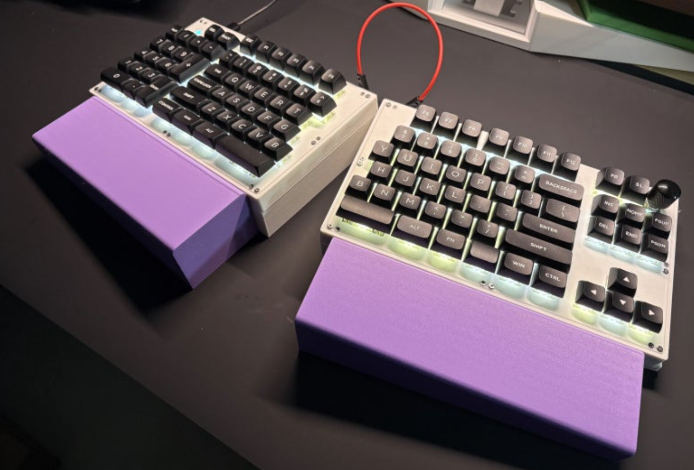

# krsplit V213

A large split ergonomic keyboard (108-key style layout, `LAYOUT_108`) with an integrated numpad on the left half, an F-row, a full navigation cluster, and a rotary encoder — built around two ATmega32U4 controllers (one per half).




* Keyboard Maintainer: [AJG](https://github.com/Kesaros44)
* Hardware Supported: krsplit V213 split keyboard (AVR / ATmega32U4)
* Hardware Availability: personal/custom build

## Hardware

- **MCU:** ATmega32U4, bootloader `atmel-dfu` (32KB flash / 1KB EEPROM)
- **Matrix:** 6 rows x 11 cols per half, `COL2ROW` diode direction
- **Split communication:** soft serial (`D0`), handedness detected via `SPLIT_USB_DETECT`
- **Encoder:** one rotary encoder, right half only (`pin_a D7`, `pin_b D6`)
- **Backlight:** single-color, PWM-driven (`BACKLIGHT_PIN B6`), 7 levels, default level 3
- **Caps Lock LED:** left half only (`D6`)
- No RGB underglow, no pointing device on this revision

### D6 pin sharing (left vs. right half)

`D6` is used for two different things depending on the half: on the **left** half it drives the Caps Lock LED, and on the **right** half it is the encoder's `pin_b`. `v213.c` handles this explicitly — `matrix_init_kb()`/`led_update_kb()` only touch the Caps Lock LED pin when `is_keyboard_left()` is true, so the right half never fights the encoder for that pin. If you ever touch this file, keep that guard — removing it silently breaks encoder rotation detection on the right half.

## Software Features

Two keymaps are maintained side by side:

- **`keymaps/default`** — plain QMK, no VIA/Vial. 4 layers:
  - `_WBASE` (Windows base)
  - `_MBASE` (Mac base — same layout, with Mac modifier keycodes and Mac-specific encoder behavior)
  - `_WMFN1` (Fn layer — media/nav/backlight controls, `QK_RBT` to reboot into the bootloader)
  - `_WMFN2` (currently blank, reserved for future use)
- **`keymaps/vial`** — VIA/Vial-enabled, only 3 dynamic layers (`_WBASE`/`_MBASE`/`_WMFN1`) — see "EEPROM/flash budget" below for why the blank 4th layer had to be dropped here.
- Encoder behavior is layer-aware: on `_MBASE` it sends volume up/down (consumer keycodes, for reliable Mac media key handling); on every other layer it sends the Windows equivalent.
- Bootmagic Lite, mouse keys, and extra keys (audio/system control) enabled; NKRO disabled by default.
- `SLEEP_LED_ENABLE` is intentionally left off — it shares a timer with `BACKLIGHT_ENABLE`, so turning both on at once causes the two to interfere with each other.

### Vial build: EEPROM/flash budget (already maxed out)

The ATmega32U4's 1KB EEPROM and 32KB flash are both nearly full on the Vial build:

- Flash: 27,824 / 28,672 bytes (97%) — `MOUSEKEY_ENABLE` had to be turned off in `keymaps/vial/rules.mk` just to fit.
- EEPROM: all 1024 bytes used — 3 dynamic-keymap layers x 12x11 matrix x 2 bytes (792B) + 3 layers of encoder mapping (12B) + QMK config-sync block (40B) + EECONFIG/VIA defaults (41B), leaving ~139B for Vial's macro editor.
- To make room, the empty 4th layer (`_WMFN2`) is excluded from the dynamic keymap (`DYNAMIC_KEYMAP_LAYER_COUNT 3` in `keymaps/vial/config.h`), and Tap Dance, Combos, Key Overrides, the Repeat Key, and Mouse Keys are all disabled in `keymaps/vial/rules.mk`.
- If you need any of those features back, something else in this list has to shrink further — there's essentially no free EEPROM left.

### Backlight and USB suspend (known QMK behavior)

This board does not currently define `NO_SUSPEND_POWER_DOWN`. By default, QMK turns the backlight off the instant the host suspends the USB connection, and restores it to full brightness — with no fade — the instant it wakes back up. If the host's USB power management periodically suspends/resumes an idle keyboard, this can show up as a visible backlight flash at that same interval. (This exact symptom was diagnosed and fixed this way on the companion P213 board — see that repo's readme for the full writeup.) If V213 ever exhibits the same flashing, adding `#define NO_SUSPEND_POWER_DOWN` to `config.h` is the fix — this is a wired keyboard, so there's no real reason to power down on suspend in the first place.

## Building

Two different QMK sources are required depending on which keymap you build — mainline QMK does not include VIA/Vial support, and vial-qmk is not kept in sync with mainline.

### Default keymap (mainline QMK)

```sh
git clone --depth 1 https://github.com/qmk/qmk_firmware.git
cd qmk_firmware
git submodule update --init --depth 1 lib/lufa lib/printf

python3 -m venv .venv && source .venv/bin/activate
pip install -r requirements.txt
pip install qmk
qmk config user.qmk_home="$(pwd)"

mkdir -p keyboards/krsplit/v213/keymaps/default
cp /path/to/V213/config.h keyboards/krsplit/v213/
cp /path/to/V213/keyboard.json keyboards/krsplit/v213/
cp /path/to/V213/v213.c keyboards/krsplit/v213/
cp /path/to/V213/krsplit.h keyboards/krsplit/v213/
cp /path/to/V213/rules.mk keyboards/krsplit/v213/
cp /path/to/V213/keymaps/default/keymap.c keyboards/krsplit/v213/keymaps/default/

make krsplit/v213:default
```

### Vial keymap (vial-kb/vial-qmk fork)

```sh
git clone --depth 1 https://github.com/vial-kb/vial-qmk.git
cd vial-qmk
git submodule update --init --depth 1 lib/lufa lib/printf

mkdir -p keyboards/krsplit/v213/keymaps/vial
cp /path/to/V213/config.h keyboards/krsplit/v213/
cp /path/to/V213/keyboard.json keyboards/krsplit/v213/
cp /path/to/V213/v213.c keyboards/krsplit/v213/
cp /path/to/V213/krsplit.h keyboards/krsplit/v213/
cp /path/to/V213/rules.mk keyboards/krsplit/v213/
cp /path/to/V213/keymaps/vial/keymap.c   keyboards/krsplit/v213/keymaps/vial/
cp /path/to/V213/keymaps/vial/rules.mk   keyboards/krsplit/v213/keymaps/vial/
cp /path/to/V213/keymaps/vial/config.h   keyboards/krsplit/v213/keymaps/vial/
cp /path/to/V213/keymaps/vial/vial.json  keyboards/krsplit/v213/keymaps/vial/

make krsplit/v213:vial
```

Pre-built `.hex` files (`krsplit_default.hex`, `krsplit_v213_vial.hex`) are included in this repo if you just want to flash without building.

## Flashing

1. Enter the bootloader:
   - Default keymap: press the `QK_RBT` key on the `_WMFN1` layer (top-left or top-right key of that layer, on either half).
   - Vial keymap: same key, same layer.
   - Alternatively, tap the reset button on the half's PCB if one is present.
2. Flash with `avrdude` or QMK Toolbox (`atmel-dfu` bootloader, `atmega32u4`).
3. For the Vial build, open the [Vial app](https://vial.rocks) — `VIAL_INSECURE` is set, so it unlocks for editing immediately, no unlock combo needed. If you want to require one, add `VIAL_UNLOCK_COMBO_ROWS`/`VIAL_UNLOCK_COMBO_COLS` to `keymaps/vial/config.h` and remove `VIAL_INSECURE`.

## Important notes / bugs found and fixed

- **`v213.c` was never actually being compiled.** QMK's build system only auto-includes a keyboard-level `.c` file that is named exactly after its own folder — for `keyboards/krsplit/v213/`, that means `v213.c`, not `krsplit.c`. The source file used to be named `krsplit.c`, so it silently never made it into any build: the Caps Lock LED / D6 pin-conflict-avoidance logic and the `backlight_enable()`/`backlight_level(3)` EEPROM-init call were dead code in every firmware shipped before this fix. Renaming it to `v213.c` (and updating `.github/workflows/build.yml` to match) fixed this — verify after any future rename that a `v213.o` (not `krsplit.o`) actually shows up under `.build/`.
- **Deprecated GPIO function names.** Once `v213.c` started actually compiling, it failed with `implicit-function-declaration` errors on `setPinOutput()`/`writePin()` — QMK 0.24.0 renamed these to `gpio_set_pin_output()`/`gpio_write_pin()` and later removed the old compatibility aliases entirely from mainline. Fixed by using the current names.
- **`DEFAULT_FOLDER` broke the `vial-qmk` CI build.** `rules.mk` used to set `DEFAULT_FOLDER = krsplit`, which mainline QMK tolerates (with a deprecation warning) but vial-qmk's Makefile does not — it failed with `No rule to make target 'krsplit/v213:vial'`. Removed since this keyboard has no sub-revisions that need it.

## CI

`.github/workflows/build.yml` builds both keymaps on every push: `build-default` against `qmk/qmk_firmware`, `build-vial` against `vial-kb/vial-qmk`. Both upload their `.hex` as a build artifact.

---

# krsplit V213 (한글)

좌우 절반에 각각 ATmega32U4 컨트롤러를 하나씩 쓰는 대형 스플릿 인체공학 키보드입니다. 108키 스타일 레이아웃(`LAYOUT_108`)을 기반으로 왼쪽 절반에 넘패드가 통합되어 있고, F열, 전체 네비게이션 클러스터, 로터리 엔코더를 갖추고 있습니다.


* 키보드 유지보수자: [AJG](https://github.com/Kesaros44)
* 지원 하드웨어: krsplit V213 스플릿 키보드 (AVR / ATmega32U4)
* 하드웨어 구입처: 개인/커스텀 제작

## 하드웨어

- **MCU:** ATmega32U4, 부트로더 `atmel-dfu` (플래시 32KB / EEPROM 1KB)
- **매트릭스:** 절반당 6행 x 11열, `COL2ROW` 다이오드 방향
- **스플릿 통신:** 소프트 시리얼(`D0`), `SPLIT_USB_DETECT`로 좌/우 자동 판별
- **엔코더:** 로터리 엔코더 1개, 우측 절반에만 존재 (`pin_a D7`, `pin_b D6`)
- **백라이트:** 단색, PWM 구동(`BACKLIGHT_PIN B6`), 7단계, 기본 레벨 3
- **캡스락 LED:** 좌측 절반에만 존재 (`D6`)
- 이 리비전에는 RGB 언더글로우, 포인팅 디바이스 없음

### D6 핀 공유 (좌/우 절반)

`D6` 핀은 좌/우 절반에서 서로 다른 용도로 쓰입니다: **좌측**에서는 캡스락 LED를 구동하고, **우측**에서는 엔코더의 `pin_b`로 사용됩니다. `v213.c`에서 이를 명시적으로 처리하고 있습니다 — `matrix_init_kb()`/`led_update_kb()`는 `is_keyboard_left()`가 참일 때만 캡스락 LED 핀을 건드리므로, 우측에서는 엔코더와 핀 충돌이 발생하지 않습니다. 이 파일을 수정할 일이 있다면 이 가드는 반드시 유지하세요 — 제거하면 우측 절반의 엔코더 회전 감지가 조용히 망가집니다.

## 소프트웨어 기능

두 개의 키맵을 나란히 유지 관리합니다:

- **`keymaps/default`** — 순정 QMK, VIA/Vial 없음. 4개 레이어:
  - `_WBASE` (Windows 베이스)
  - `_MBASE` (Mac 베이스 — 레이아웃은 동일하지만 Mac용 모디파이어 키코드와 Mac 전용 엔코더 동작 포함)
  - `_WMFN1` (Fn 레이어 — 미디어/네비게이션/백라이트 컨트롤, 부트로더 진입용 `QK_RBT`)
  - `_WMFN2` (현재 비어있음, 향후 사용을 위해 예약)
- **`keymaps/vial`** — VIA/Vial 지원, 다이나믹 레이어는 3개(`_WBASE`/`_MBASE`/`_WMFN1`)만 존재 — 빈 4번째 레이어를 여기서 제외해야 했던 이유는 아래 "EEPROM/플래시 예산" 항목 참고.
- 엔코더 동작은 레이어에 따라 달라집니다: `_MBASE`에서는 볼륨 업/다운(컨슈머 키코드, Mac 미디어 키 처리를 안정적으로 하기 위함)을 보내고, 그 외 레이어에서는 Windows용 동작을 보냅니다.
- Bootmagic Lite, 마우스키, 추가 키(오디오/시스템 제어) 활성화됨; NKRO는 기본적으로 비활성화.
- `SLEEP_LED_ENABLE`은 의도적으로 꺼져 있습니다 — `BACKLIGHT_ENABLE`과 타이머를 공유하기 때문에 둘 다 켜면 서로 간섭합니다.

### Vial 빌드: EEPROM/플래시 예산 (이미 한계까지 사용 중)

ATmega32U4의 1KB EEPROM과 32KB 플래시 모두 Vial 빌드에서 거의 가득 찼습니다:

- 플래시: 27,824 / 28,672 바이트 (97%) — 용량을 맞추기 위해 `keymaps/vial/rules.mk`에서 `MOUSEKEY_ENABLE`을 꺼야 했습니다.
- EEPROM: 1024바이트 전부 사용 — 다이나믹 키맵 3레이어 x 12x11 매트릭스 x 2바이트(792B) + 엔코더 매핑 3레이어(12B) + QMK 설정 동기화 블록(40B) + EECONFIG/VIA 기본값(41B), 남는 약 139B는 Vial 매크로 에디터용.
- 공간을 확보하기 위해 빈 4번째 레이어(`_WMFN2`)를 다이나믹 키맵에서 제외했고(`keymaps/vial/config.h`의 `DYNAMIC_KEYMAP_LAYER_COUNT 3`), 탭댄스/콤보/키 오버라이드/리핏 키/마우스키를 전부 `keymaps/vial/rules.mk`에서 비활성화했습니다.
- 이 기능들 중 하나라도 다시 켜려면 목록의 다른 무언가를 더 줄여야 합니다 — 남는 EEPROM이 사실상 없습니다.

### 백라이트와 USB 서스펜드 (QMK의 알려진 동작)

이 보드는 현재 `NO_SUSPEND_POWER_DOWN`을 정의하지 않았습니다. QMK는 기본적으로 호스트가 USB 연결을 서스펜드하는 즉시 백라이트를 끄고, 다시 깨어나는 즉시 페이드 없이 최대 밝기로 복원합니다. 호스트의 USB 전원 관리가 유휴 상태의 키보드를 주기적으로 서스펜드/레주메한다면, 같은 주기로 백라이트가 깜빡이는 현상이 눈에 띌 수 있습니다. (동일한 증상이 자매 보드인 P213에서 진단되어 이 방식으로 해결된 적이 있습니다 — 자세한 내용은 해당 저장소의 readme 참고.) 만약 V213에서도 같은 깜빡임이 나타난다면 `config.h`에 `#define NO_SUSPEND_POWER_DOWN`을 추가하면 해결됩니다 — 어차피 유선 키보드라서 서스펜드 시 전원을 내릴 실질적인 이유가 없습니다.

## 빌드하기

어떤 키맵을 빌드하느냐에 따라 서로 다른 QMK 소스가 필요합니다 — mainline QMK에는 VIA/Vial 지원이 없고, vial-qmk는 mainline과 동기화되어 있지 않습니다.

### Default 키맵 (mainline QMK)

```sh
git clone --depth 1 https://github.com/qmk/qmk_firmware.git
cd qmk_firmware
git submodule update --init --depth 1 lib/lufa lib/printf

python3 -m venv .venv && source .venv/bin/activate
pip install -r requirements.txt
pip install qmk
qmk config user.qmk_home="$(pwd)"

mkdir -p keyboards/krsplit/v213/keymaps/default
cp /path/to/V213/config.h keyboards/krsplit/v213/
cp /path/to/V213/keyboard.json keyboards/krsplit/v213/
cp /path/to/V213/v213.c keyboards/krsplit/v213/
cp /path/to/V213/krsplit.h keyboards/krsplit/v213/
cp /path/to/V213/rules.mk keyboards/krsplit/v213/
cp /path/to/V213/keymaps/default/keymap.c keyboards/krsplit/v213/keymaps/default/

make krsplit/v213:default
```

### Vial 키맵 (vial-kb/vial-qmk 포크)

```sh
git clone --depth 1 https://github.com/vial-kb/vial-qmk.git
cd vial-qmk
git submodule update --init --depth 1 lib/lufa lib/printf

mkdir -p keyboards/krsplit/v213/keymaps/vial
cp /path/to/V213/config.h keyboards/krsplit/v213/
cp /path/to/V213/keyboard.json keyboards/krsplit/v213/
cp /path/to/V213/v213.c keyboards/krsplit/v213/
cp /path/to/V213/krsplit.h keyboards/krsplit/v213/
cp /path/to/V213/rules.mk keyboards/krsplit/v213/
cp /path/to/V213/keymaps/vial/keymap.c   keyboards/krsplit/v213/keymaps/vial/
cp /path/to/V213/keymaps/vial/rules.mk   keyboards/krsplit/v213/keymaps/vial/
cp /path/to/V213/keymaps/vial/config.h   keyboards/krsplit/v213/keymaps/vial/
cp /path/to/V213/keymaps/vial/vial.json  keyboards/krsplit/v213/keymaps/vial/

make krsplit/v213:vial
```

빌드 없이 바로 플래시만 하고 싶다면, 미리 컴파일된 `.hex` 파일(`krsplit_default.hex`, `krsplit_v213_vial.hex`)이 이 저장소에 포함되어 있습니다.

## 플래시하기

1. 부트로더 진입:
   - Default 키맵: `_WMFN1` 레이어의 `QK_RBT` 키를 누릅니다 (양쪽 절반 모두 해당 레이어의 좌상단 또는 우상단 키).
   - Vial 키맵: 동일한 키, 동일한 레이어.
   - 또는 절반 PCB에 리셋 버튼이 있다면 그것을 누릅니다.
2. `avrdude` 또는 QMK Toolbox로 플래시합니다 (`atmel-dfu` 부트로더, `atmega32u4`).
3. Vial 빌드의 경우 [Vial 앱](https://vial.rocks)을 엽니다 — `VIAL_INSECURE`가 설정되어 있어서 언락 콤보 없이 바로 편집할 수 있습니다. 언락 콤보를 요구하려면 `keymaps/vial/config.h`에 `VIAL_UNLOCK_COMBO_ROWS`/`VIAL_UNLOCK_COMBO_COLS`를 추가하고 `VIAL_INSECURE`를 제거하세요.

## 중요 참고사항 / 발견 및 수정된 버그

- **`v213.c`가 실제로는 한 번도 컴파일되지 않고 있었습니다.** QMK 빌드 시스템은 자신이 속한 폴더 이름과 정확히 일치하는 이름의 키보드 레벨 `.c` 파일만 자동으로 포함합니다 — `keyboards/krsplit/v213/`의 경우 `krsplit.c`가 아니라 `v213.c`여야 합니다. 소스 파일 이름이 원래 `krsplit.c`였기 때문에 이 수정 이전에 배포된 모든 펌웨어에서 캡스락 LED/D6 핀 충돌 방지 로직과 `backlight_enable()`/`backlight_level(3)` EEPROM 초기화 코드가 조용히 죽은 코드였습니다. 파일명을 `v213.c`로 바꾸고(`.github/workflows/build.yml`도 함께 수정) 해결했습니다 — 앞으로 이름을 바꿀 일이 있다면 `.build/` 아래에 `krsplit.o`가 아니라 `v213.o`가 실제로 생기는지 반드시 확인하세요.
- **더 이상 쓰이지 않는 GPIO 함수 이름.** `v213.c`가 실제로 컴파일되기 시작하자 `setPinOutput()`/`writePin()`에서 `implicit-function-declaration` 오류가 발생했습니다 — QMK 0.24.0에서 이 함수들이 `gpio_set_pin_output()`/`gpio_write_pin()`으로 이름이 바뀌었고, 이후 mainline에서 기존 호환용 별칭이 완전히 제거되었습니다. 현재 이름으로 수정해서 해결했습니다.
- **`DEFAULT_FOLDER`가 `vial-qmk` CI 빌드를 깨뜨렸습니다.** 기존 `rules.mk`에는 `DEFAULT_FOLDER = krsplit`이 설정되어 있었는데, mainline QMK는 이를 허용(deprecation 경고만 표시)하지만 vial-qmk의 Makefile은 허용하지 않아 `No rule to make target 'krsplit/v213:vial'` 오류가 발생했습니다. 이 키보드에는 하위 리비전이 없어 필요 없으므로 제거했습니다.

## CI

`.github/workflows/build.yml`이 push할 때마다 두 키맵을 모두 빌드합니다: `build-default`는 `qmk/qmk_firmware` 기준, `build-vial`은 `vial-kb/vial-qmk` 기준. 둘 다 결과 `.hex`를 빌드 아티팩트로 업로드합니다.
